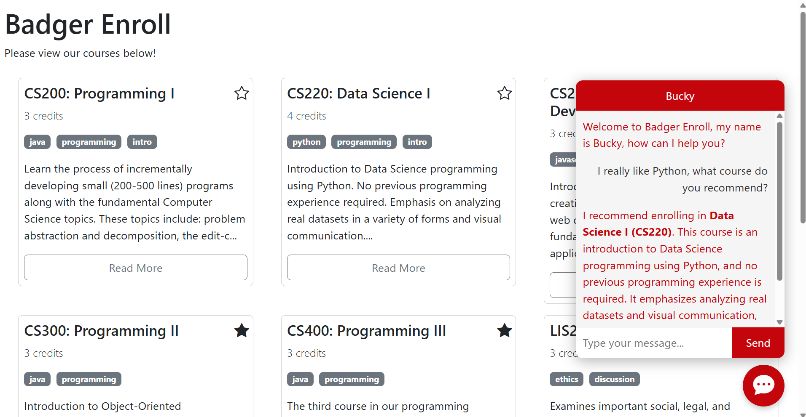

# CS272-S25 HW10: Badger Enroll

In this final JavaScript HW, you will be extending our in-class exercise of Badger Enroll to provide a chat agent with AI-powered recommendations!

## Instructions

### 1. Enter `MY_SECRET`

Enter your secret code emailed to you on April 15th via email titled "CS272/472 Secret Authorization Code" into `MY_SECRET` within `app.js` Your code will not work without this!

### 2. Fetch Course Data

In `chatbot.js`, we feed the course numbers to our AI agent; however, these are fixed and contain no description or meta information about the course offerings. Instead, replace this hardcoded string with the data fetched from `https://cs272.cs.wisc.edu/rest/s25/ice/courses`

You should append a `developer` message to `CONVERSATION` with something along the lines of `"Here is the UW-Madison course information provided as JSON: " + JSON.stringify(data)` where `data` is the course data fetched from the above API.

### 3. Engage in Conversation

In `chatbot.js`, implement `sendMessage` such that the user's message gets appended to the ongoing `CONVERSATION` and sent to the AI API via `https://cs272.cs.wisc.edu/rest/s25/hw10/ai`. The AI's response should be appended to the ongoing `CONVERSATION` and displayed to the user. You do *not* need to handle the errorenous cases such as when the conversation gets too long or moves too quickly.

By completing this step, you should have a functioning chat agent that you can converse with and get course recommendations from! 🤖

## Congratulations! 🎉

You're done with your final JS HW! 🥳 Be sure to add, commit, and push your code.